2024 vasario 23 gavome raktus į naujas patalpas „Kauno Energijos“ rūsyje ir
prasidėjo įsikūrimo darbai.

Nulieję daug prakaito ir kraujo pristatome keletą nuotraukų kaip patalpos
atrodė prieš pradedant darbus ir kaip atrodo dabar, praėjus metams.

<!--more-->

    <h3>Koridorius</h3>
    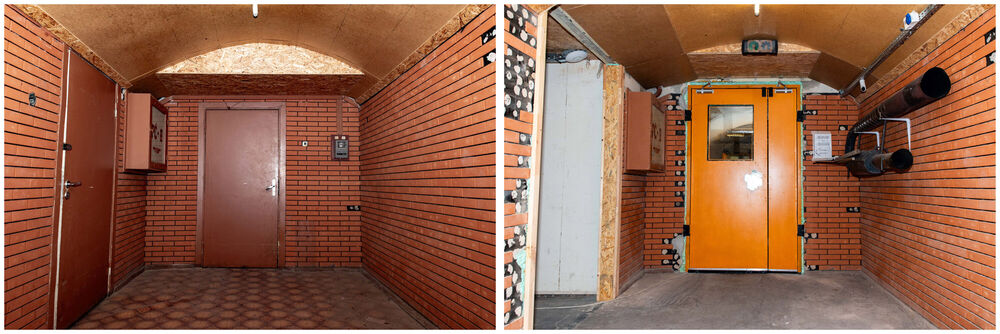
    <h3>Elektronika</h3>
    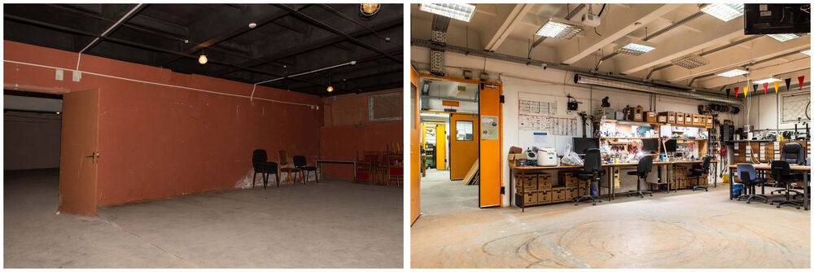
    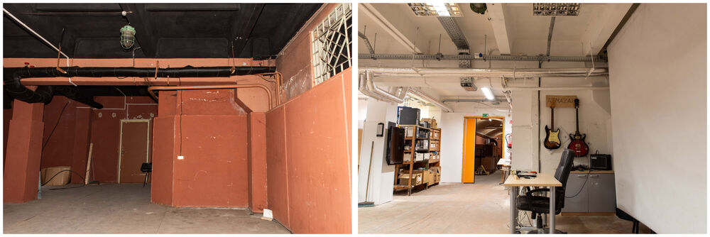
    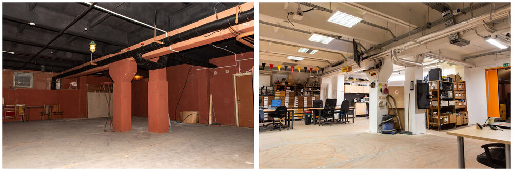
    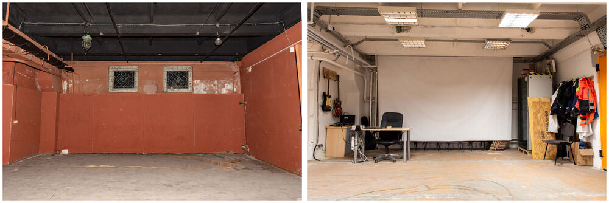
    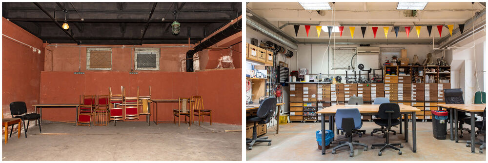
    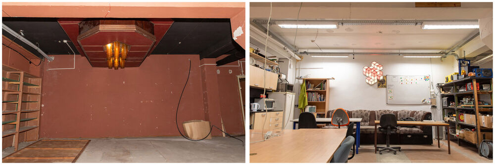
    <h3>Medžiagų sandėlis</h3>
    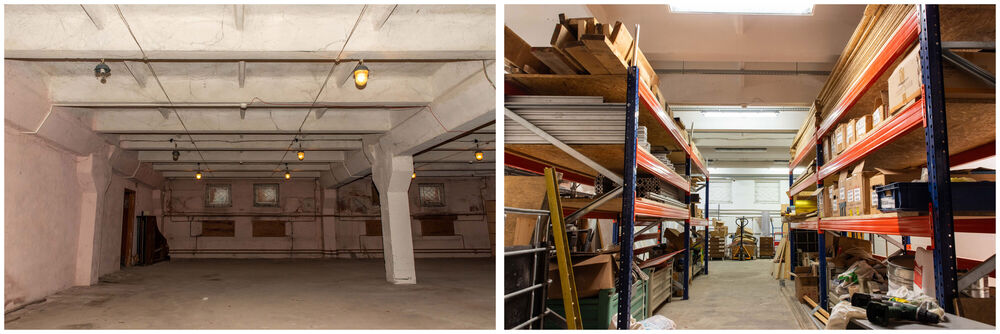
    <h3>Purvinos</h3>
    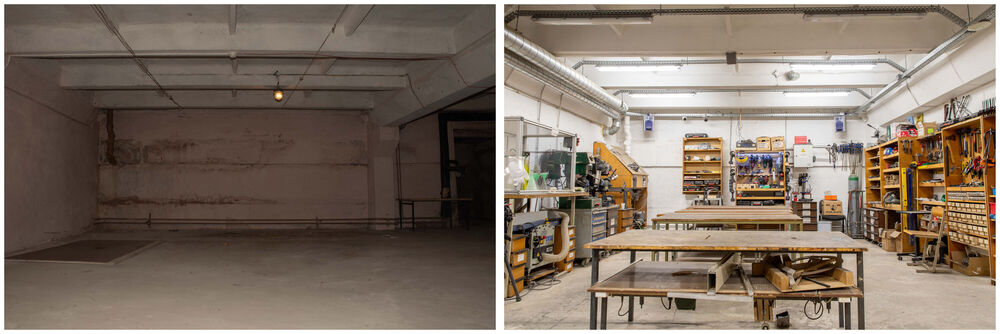
    <h3>Staklidė - „kripta“</h3>
    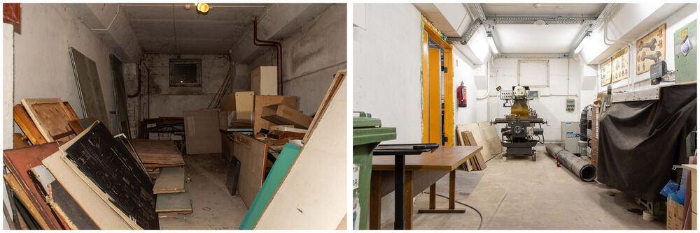
    <h3>Rūbinė</h3>
    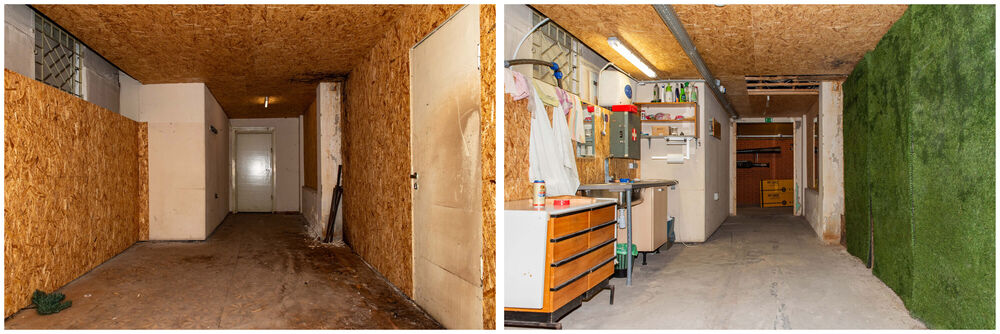
    <h3>Projektai</h3>
    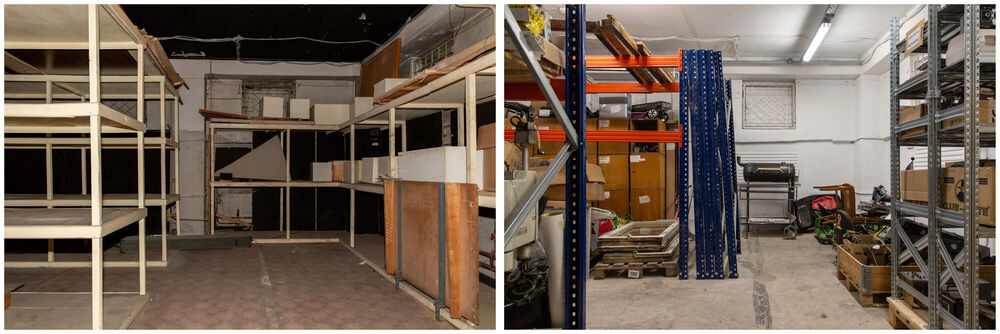
    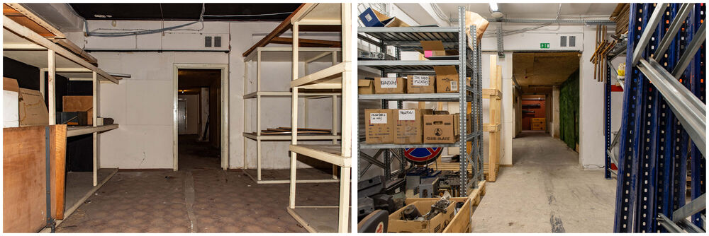



